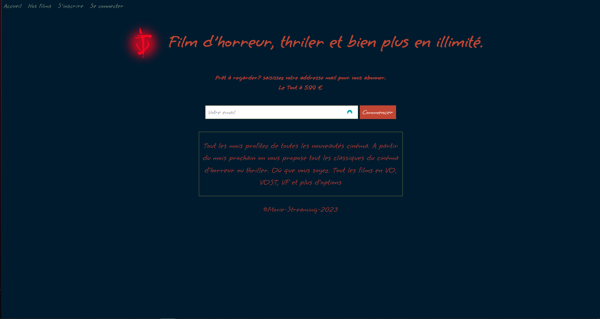
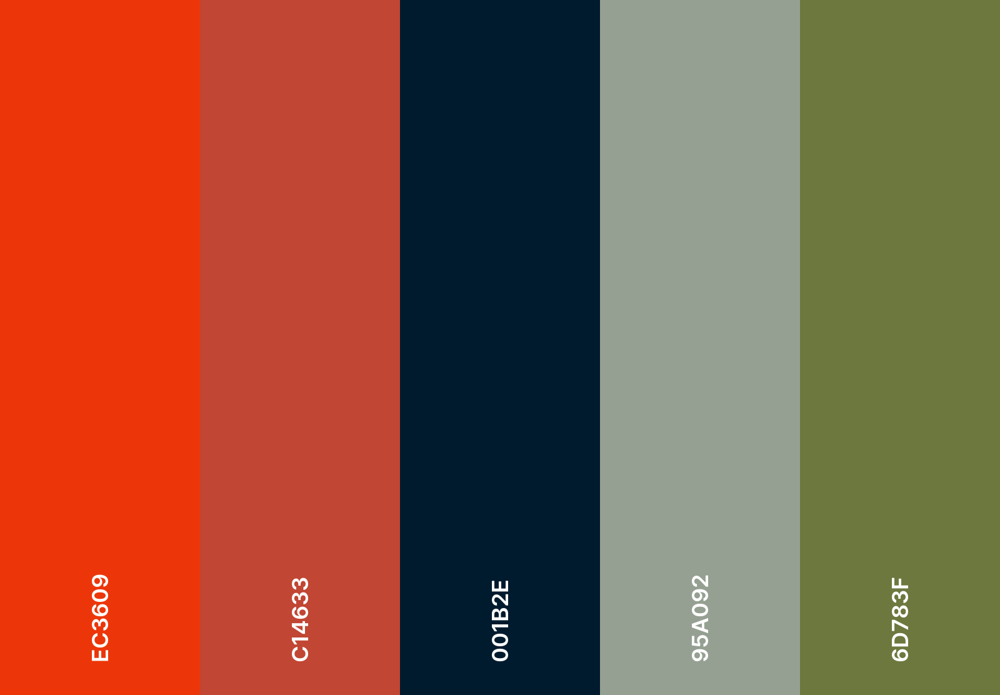

# Doomovie
Une Agence web nous confie la réalisation d’une application/site promotionnelle pour une diffusion exclusive de films d’horreur, thriller et science fiction en streaming. La promotion a pour but de conquérir des abonnés, en proposant la diffusion de tous les classiques du cinéma d'horreur, thriller et science fiction. Pour cela nous propose d’abord d’analyser toutes les fonctionnalités au travers des deux wireframes. Les spécifications pour le fonctionnement de chaque partie ne sont pas définies. La charte graphique est en cours d’élaboration.

## Palette graphique

## Police de caractère : Grape Nuts

## Auteur

Quang Quan - 2024

[Cinéma horreur](https://quangquan117.github.io/Projet_cinema/)